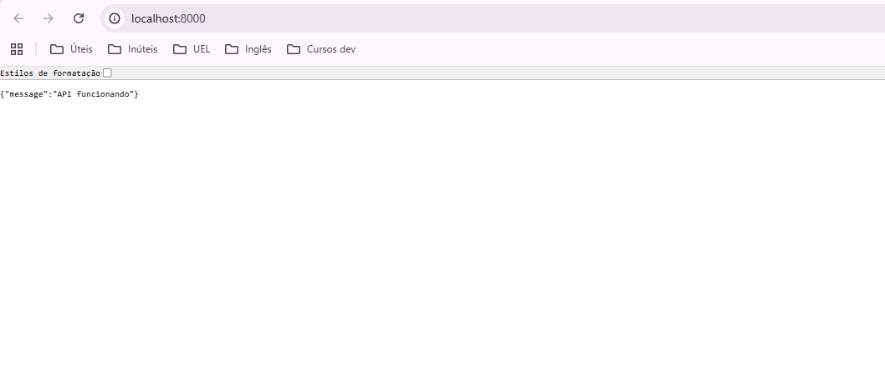

# Sistema-Avaliaco-Locais-UEL
Sistema de avaliações de locais da UEL

## Como rodar o projeto

#### 1. **Rodar o Back-end (FastAPI)**:

Pelo terminal, entrar na pasta backend e rodar:
```bash
  cd backend
  python -m venv venv    
```
Em seguida,
```bash
venv\Scripts\Activate.ps1  
```
Em seguida,
```bash
  venv\Scripts\activate.bat
```
Em seguida,
```bash
  pip install -r requirements.txt  
```
Por útlimo
```bash
  uvicorn main:app --reload  
```

Isso irá baixar dependências necessárias para rodar o projeto e em seguida iniciá-lo.
O backend estará disponível em http://localhost:8000/

O que você deve ver ao rodar o backend:


#### 2. **Rodar o Front-end (React)**:

Pelo terminal, entrar na pasta frontend e rodar:
```bash
  cd frontend
  npm install
  npm install react-router-dom
```
Isso irá baixar dependências necessárias para rodar o projeot.

Rodar o React:
```bash
   npm start
```
O React será aberto em: http://localhost:3000
Ele se conecta automaticamente com a API do back-end.